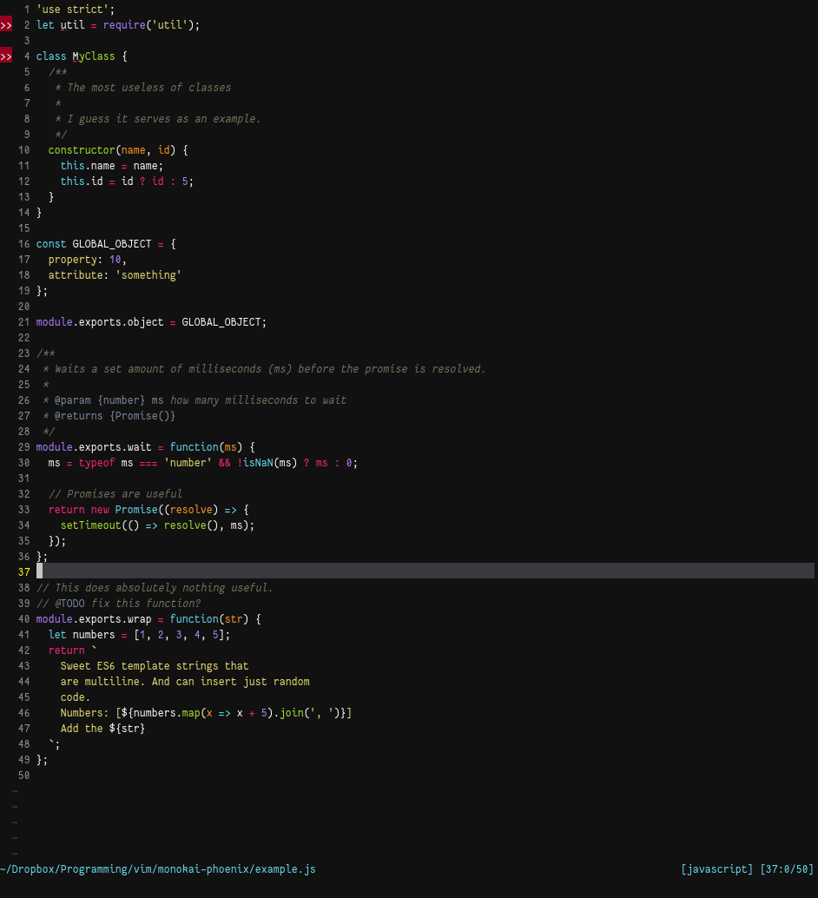
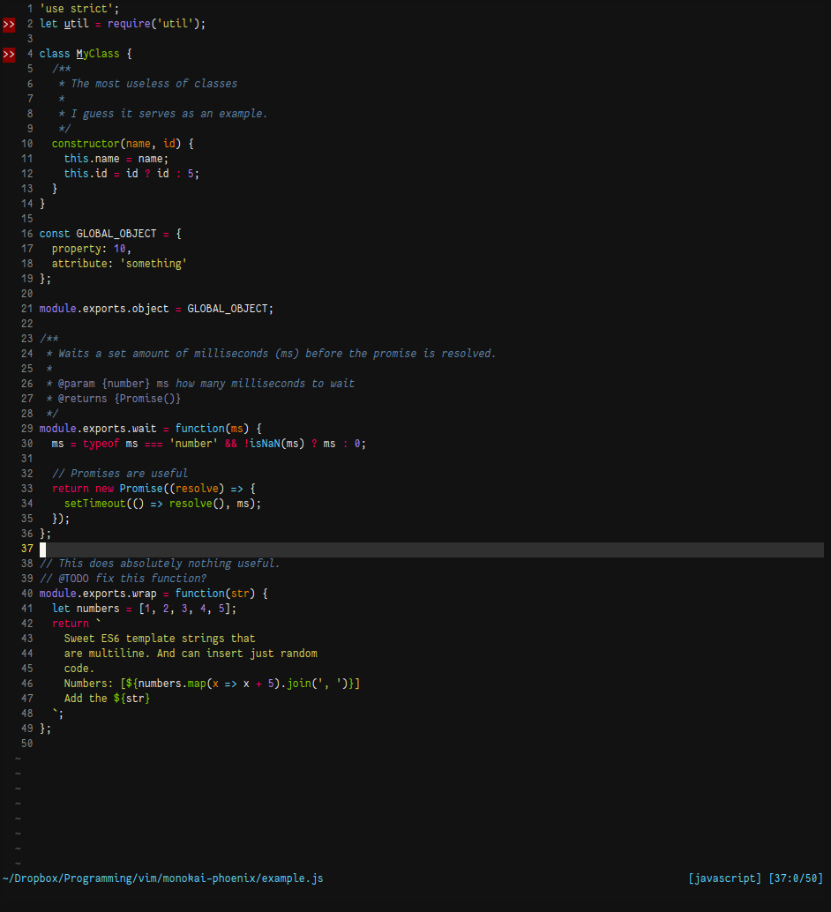

# vim-monokai-phoenix

A different monokai phoenix theme for Vim, based on Monokai-phoenix found in the Javascript-Next Sublime package.

For the optimal JavaScript syntax experience, it is recommended to use [pangloss/vim-javascript](https://github.com/pangloss/vim-javascript) for your JS syntax needs.

## Installation

Using Plug, you can do the following:

```vim
Plug 'reewr/vim-monokai-phoenix'
```

Then do :PlugInstall and you're good to go

## Screenshot

Example in GVIM / Terminal with True color



Example in terminal using 256 colors


## About

This colour scheme is still being adjusted as it was created from scratch using the Sublime version as inspiration. There are some differences, mostly due to personal taste.

If you have some suggestions on how to improve the colour scheme, please make an issue.

## Issues

Below follows issues that are outside of my control.

- [nvim-qt#145](https://github.com/equalsraf/neovim-qt/issues/145) does not apply terminal cursor colour correctly. This is specific to this application and I can therefore not apply a fix directly. There is however a fix for it: `hi TermCursor cterm=reverse gui=reverse` should display the cursor correctly.
